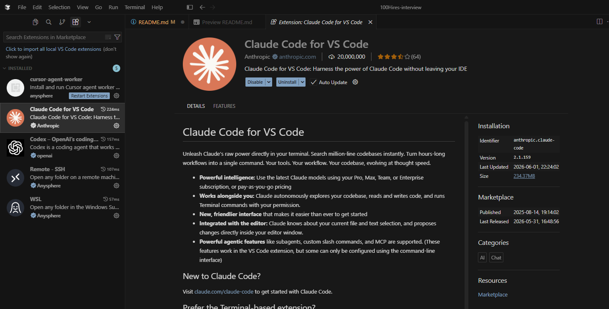
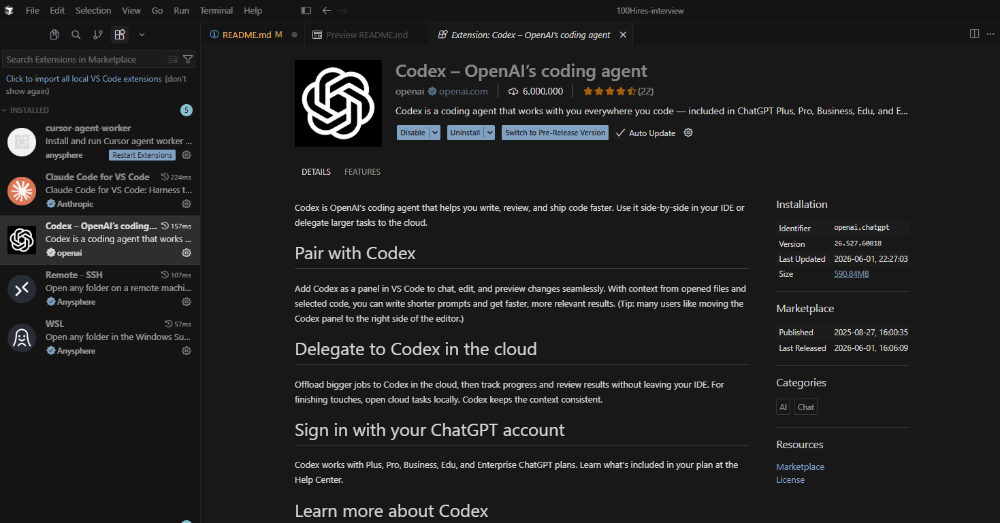

# Proceso de Instalación y Configuración del Entorno de Desarrollo - Cursor IDE

Este repositorio ha sido creado como parte del proceso de evaluación técnica para demostrar la correcta instalación, configuración y resolución de problemas en el entorno de desarrollo **Cursor IDE**, junto con la integración de extensiones de inteligencia artificial aplicadas al desarrollo de software.

A continuación, se detallan las herramientas instaladas, los pasos ejecutados y los desafíos técnicos superados durante el proceso.

---

## 🛠️ Herramientas Instaladas

1. **Cursor IDE**: Editor de código basado en una bifurcación (fork) de VS Code, optimizado nativamente para flujos de trabajo orientados a la programación asistida por Inteligencia Artificial.
2. **Claude Code (Add-on)**: Extensión oficial orientada a la asistencia en código utilizando los modelos avanzados de Anthropic (Claude), permitiendo la automatización de tareas y refactorización guiada.
3. **Codex / ChatGPT (Add-on)**: Extensión de asistencia de IA orientada a la generación de código, consultas en lenguaje natural y optimización de funciones utilizando modelos basados en OpenAI.
4. **Git & GitHub**: Control de versiones para el seguimiento del proyecto y alojamiento público del repositorio.

---

## 🚀 Pasos Completados

1. **Descarga e Instalación del IDE**: Se descargó el instalador oficial de Cursor desde su sitio web oficial (https://cursor.com/) y se procedió con la instalación estándar en el sistema operativo.
2. **Configuración de la Cuenta de GitHub**: Creación y validación del perfil en GitHub, seguido de la creación de este repositorio público para almacenar las evidencias de la prueba.
3. **Configuración del Entorno de Terminal (CLI)**: Vinculación de Cursor con la terminal del sistema para habilitar su ejecución mediante comandos directos.
4. **Instalación de Extensiones vía CLI**: Descarga forzada e instalación de los módulos complementarios requeridos para la prueba técnica.
5. **Apertura del Repositorio y Verificación**: Inicialización del entorno de trabajo directamente desde la consola, validando la persistencia de las extensiones y el espacio de trabajo.
6. **Control de Versiones**: Documentación (este archivo `README.md`), confirmación de cambios (`git commit`) y publicación en el entorno remoto (`git push`).

---

## 🔍 Inconvenientes Detectados y Soluciones Aplicadas

Durante el proceso de configuración se presentaron ciertos desafíos técnicos que requirieron investigación y diagnóstico. 

### 1. Ausencia de Extensiones en el Marketplace Visual
* **Problema**: Al buscar las extensiones `"Claude Code"` y `"Codex"` dentro del apartado visual de extensiones (*Extensions Marketplace*) dentro de Cursor, el buscador no arrojaba resultados o no aparecían listadas de forma directa.
* **Investigación**: Al recordar que Cursor mantiene compatibilidad con la arquitectura de VS Code, investigué la posibilidad de interactuar con el gestor de extensiones a través de la interfaz de línea de comandos (CLI).
* **Solución**:
  * Configuré la variable de entorno del sistema (`PATH`) para que la terminal reconociera el binario de Cursor de forma global.
  * Utilicé la herramienta CLI de Cursor para forzar la instalación remota apuntando directamente a los identificadores únicos de los paquetes mediante los siguientes comandos:


```bash
    cursor --install-extension anthropic.claude-code
    cursor --install-extension openai.chatgpt
```

### 2. Sincronización del Entorno de Trabajo (Contexto del IDE)

* **Problema**: Al abrir la aplicación desde el acceso directo del sistema operativo, el espacio de trabajo iniciaba vacío y en ocasiones las extensiones recién instaladas por consola no se reflejaban de inmediato en la interfaz.
* **Descubrimiento técnico**: Al cambiar el flujo de apertura y ejecutar el IDE directamente desde la terminal posicionándome en la carpeta del repositorio con el comando:

```bash
  cursor ./
```

Noté que la aplicación inicializa aplicando correctamente el contexto del directorio de trabajo actual. Esto permitió validar visualmente en la barra lateral que ambas extensiones se habían instalado y acoplado de manera correcta a la sesión.

## Evidencias

